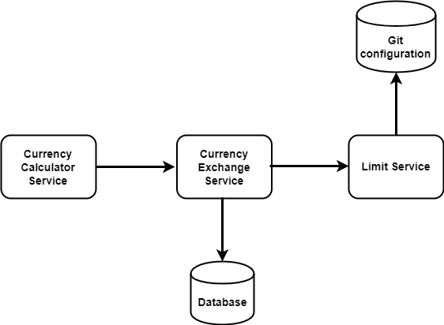

# Project Title

Currency Converter Microservice

## Description
 This Java-SpringBoot based microservice is for converting currencies for the Scion GT86 Project
 
 Based on tutorial here: https://www.youtube.com/playlist?list=PLpvkV3-o1B598IJEMjL65rMICJoIejtF6

## Tooling

* Utilisation of Spring Cloud and Git configuration
* Spring Initiliazer from Maven
* JPA Repository
* Communication between microservice and main project using EUREKA
* Rest Controller
* Ribbon for Client-side load balancing
* Zuul API Gateway, Distributed Tracing, Spring Cloud Sleuth
* Rabbit MQ and Erlang for implementing tracing server
* Spring Cloud Bus
* Hystrix for fault tolerance

## Diagram

